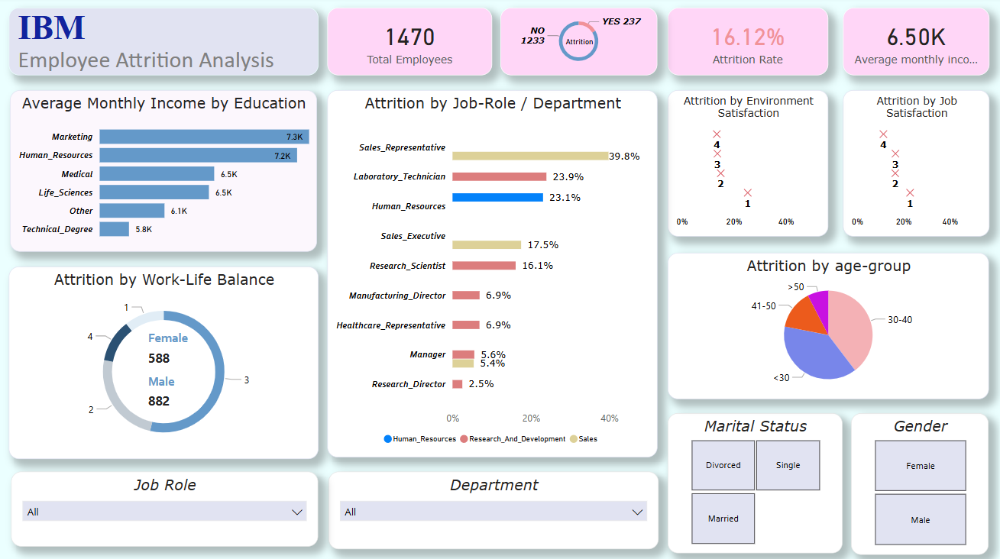

# Employee-Attrition-Analysis

# Objective: To analyze employee attrition trends, identify contributing factors, and derive business insights using structured query language (SQL). The goal is to help HR departments reduce turnover and improve employee satisfaction.

# Tools Used: - SQL (Microsoft SQL server) , 
            - Power BI (for dashboarding)

# Dataset: Age, Gender, Salary, Department, Education, Attrition, Job Role, Work-Life Balance, etc.

# Steps Involved: - Data Cleaning in SQL
#                 - Data Transformation
#                 - Exploratory Data Analysis with SQL
#                 - Built Power BI Dashboard

Dashboard Preview: 
